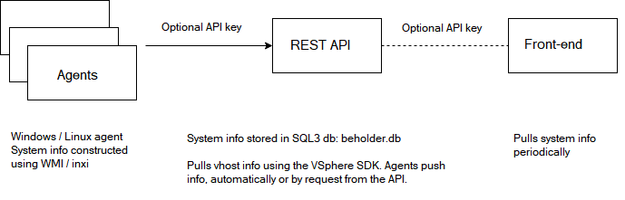

# sizingservers.beholder.agent
    2018 Sizing Servers Lab  
    University College of West-Flanders, Department GKG

This project is part of a computer hardware inventorization solution, together with sizingservers.beholder.dnfapi and sizingservers.beholder.frontend.

Agents are installed on the computers / VMs you want to inventorize. Tools like Puppet or Chef can help you automate this.

An agent communicates with the REST API which stores hardware info. The front-end app visualizes that info. 

## Languages, libraries, tools, technologies used and overview
The code is encapsulated in a **Visual Studio 2017** solution. The available agents are console applications.

Communication to the API happens over HTTP. See the sizingservers.beholder.dnfapi documentation for an overview.

### Agent selector
The sizingservers.beholder.agent console app does nothing more than checking the OS and launching the correct agent.

Runs using **dotnet core 2.x**, target framework netcoreapp2.0.

### Linux agent
Reads the standard output of **inxi** (<https://github.com/smxi/inxi>). Check the SystemInformationRetreiver class to see how this works.

Runs using **dotnet core 2.x**, target framework netcoreapp2.0. Needs **gawk**, **ipmitool** and **dmidecode**.

### Windows agent
Uses **WMI** to gather system info.

Runs as a Windows executable, target framework net47.

### Shared functionality
Contains the agent configuration functionality, the SystemInformation class and a reporter class to periodically send JSON serialized info (**NewtonSoft.Json**) to the API over HTTP.

Contains a request report handler as well: a TCP server that listens at a configurable port for the phrase "requestreport\r\n".  
This functionality exists so we can have the best of both pushing and polling: push info at startup and once a e.g. day to the API. The API can request system info to determine if the agent is still alive.

Multi-targets netcoreapp2.0 and net47 to be usable in the Linux- and Windows agent both. Open the solution using Visual Studio and right-click the project and click *Edit...* to check this. *Ignore the reference warning. Multi-targeting works as it should.*

## Build
You need the dotnet SDK (<https://www.microsoft.com/net/learn/get-started/linux/ubuntu18-04>) to build the source and the .Net framework SDK (<https://www.microsoft.com/en-us/download/details.aspx?id=55168>) if building on Windows.

You need to be connected to the Internet for restoring NuGet packages.

Execute *build_Windows.cmd* (or build_Linux.sh on Linux, do not forget chmod +x, debug config used):

    REM 2017 Sizing Servers Lab
    REM University College of West-Flanders, Department GKG 
    echo sizingservers.beholder.agent build script
    echo ----------
    rmdir /S /Q Build
    cd sizingservers.beholder.agent
    dotnet restore
    dotnet publish -c Debug
    cd ..\sizingservers.beholder.agent.linux
    dotnet restore
    dotnet publish -c Debug
    cd ..\sizingservers.beholder.agent.windows
    dotnet restore
    dotnet build -c Debug
    cd ..
    copy /Y Build\netcoreapp1.1\publish\* Build\
    rmdir /S /Q Build\netcoreapp1.1\
    copy /Y Build\Linux\netcoreapp1.1\publish\* Build\Linux
    rmdir /S /Q Build\Linux\netcoreapp1.1\
    
## Configure

I recommend setting the *report frequency* not to, euhm, frequent. It is important that the agent registers itself to the API at startup, or at a time that the API is available should the API not be running.

Leave the report frequency to the API *PollIntervalInSeconds* setting.

### sizingservers.beholder.agent.conf
    # URL to the REST API where info will be pushed to.
    # endpoint http://x.x.x.x:0000/systeminfromations
    endpoint http://localhost/BeholderDnfApi/systeminformations
    
    # API Key
    apiKey <insert a SHA-512 of a piece of text here> 

    # Uncomment / edit the one you want. Defaults to reportEvery day.
    # reportEvery minute
    # reportEvery 20 minutes
    # reportEvery hour
    # reportEvery 5 hours
    reportEvery day
    
    # Listens to this port for a "requestreport\r\n" from the api.
    requestReportTcpPort 56575
    
Needs to be configured in the Linux and Windows Build folder both.

## Run
Tested on Ubuntu 16.04 to 18.04 and Windows 10 / Server 2016.

You need the .NET core runtime (included in the SDK) to run the build: 2.0 at the time of writing.

Execute 

    apt install gawk ipmitool

on Linux (Ubuntu).

You need the .NET framework on Windows, but you have that by default.

Execute **run.cmd** or **run.sh** (do not forget chmod +x). Please note the Linux' dmidecode needs root rights.

BETTER is to run the Linux- or Windows agent as a service.  
For that you need to use either use **screen** for Linux or **NSSM** / **startAsService.cmd** for Windows in the Linux or the Windows folder.

**startAsService.cmd**, run as administrator!:

    REM 2018 Sizing Servers Lab
    REM University College of West-Flanders, Department GKG 
    echo sizingservers.beholder.agent for Windows start as service script
    echo Please note that this script needs administrator privileges. If not 'ran as administrator', please do so.
    echo ----------
    nssm remove sizingservers.beholder.agent confirm
    nssm install sizingservers.beholder.agent sizingservers.beholder.agent.windows.exe
    nssm start sizingservers.beholder.agent
    echo If you get system info on the frontend , everything is working. If not, check if you have set the endpoint in the config correctly or the Windows Event Viewer for errors, if any.
    
## Example output
Arrays are formatted tab-space delimited values, for efficiency: no need to do conversions for dbs, like SQLite3, that cannot handle arrays.

Notice that the *requestReportTcpPort* in in the output so the API knows what port to communicate to.

### Linux agent

    {
      "hostname": "Dieter-Ubu",
      "ips": "192.168.20.175\tfe80::250:56ff:fe92:1034",
      "os": "Ubuntu 18.04 LTS - kernel ",
      "system": "VMware product - VMware Virtual Platform",
      "baseboard": "Intel model - 440BX Desktop Reference Platform",
      "bios": "Phoenix v - 6.00 date - 04/05/2016",
      "processors": "8 Single core Intel Xeon X7560s (-SMP-)",
      "memoryModules": "Using dmidecode - you must be root to run dmidecode",
      "disks": "ID-1 - /dev/sda model - Virtual_disk size - 10.7GB",
      "nics": "VMware VMXNET3 Ethernet Controller driver - vmxnet3 v - 1.4.a.0-k port - 4000 bus-ID - 03:00.0",
      "bmcIp": "ipmitool not installed or no BMC available",
      "requestReportTcpPort": 56575
    }
    
 *See what happens if you do not run as root?*
 
 ### Windows agent
 
     {
      "hostname": "DELL-DIDJEEH.WORKGROUP",
      "ips": "192.168.117.1",
      "os": "Microsoft Windows 10 Pro 10.0.17134 Build 17134",
      "system": "Dell Inc. - Latitude E5570",
      "baseboard": "Dell Inc. - product: 06YF8N",
      "bios": "1.18.6",
      "processors": "Intel(R) Core(TM) i7-6820HQ CPU @ 2.70GHz",
      "memoryModules": "8 GB - manufacturer: SK Hynix - part number: HMA41GS6AFR8N-TF (2133 Mhz) x2",
      "disks": "476 GB - SK hynix SC308 SATA 512GB",
      "nics": "Ethernet - Intel(R) Ethernet Connection (2) I219-LM (disconnected)\tWi-Fi - Intel(R) Dual Band Wireless-AC 8260 (connected)",
      "bmcIp": "BMC not found",
      "requestReportTcpPort": 56575
    }